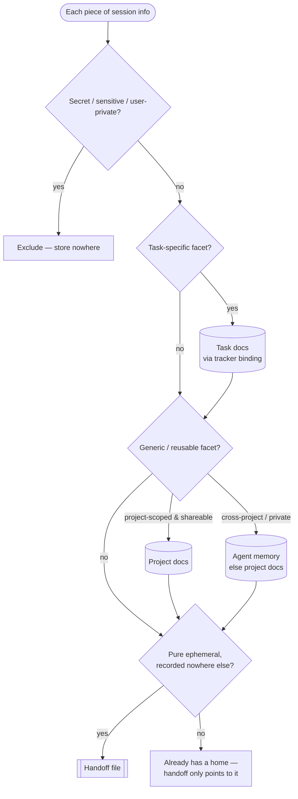
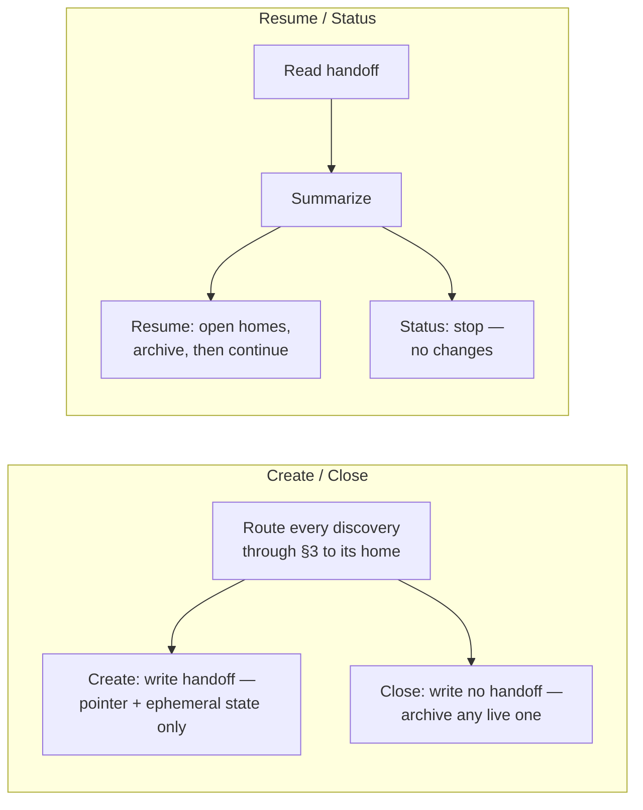

# Handoff skill — portable package

[](LICENSE)
[](CONTRIBUTING.md)
[](https://github.com/uchimata2/handoff-skill/releases)

A drop-in **handoff** skill: it lets any AI working session — a later session, another
agent, or another person — pick up work seamlessly, while keeping a strict single source
of truth. Every fact has exactly one home, and the handoff only *points* to those homes.
It works in any project (development or not), with or without an external task tracker,
and across agents.

## What's in here

- `handoff.core.md` — the always-loaded **spine**: configuration, the routing model, detection,
  session types, and the binding contract.
- `flows/` — the two on-demand flow files the spine loads per run: `create.md` (Create / Close)
  and `resume.md` (Resume / Status).
- `config.example.md` — the per-project config schema.
- `bindings/` — tracker bindings (`notion`, `local-markdown`, `local-markdown-dir`) + how to write your own.
- `agents/` — per-agent stub templates (`claude.SKILL.md`, `copilot.agent.md`), plus
  optional Claude Code hook reminders (`claude.hooks.md`).
- `EXAMPLES.md` — annotated good-vs-bad handoffs and walkthroughs by session type.
- `README.md` — this file.

Nothing here is project-specific; all specifics live in the config you create. The above is a
conceptual overview; the authoritative list of files bundled into the `handoff.skill` artifact is
the `$items` manifest in [`scripts/build-skill.ps1`](scripts/build-skill.ps1).

## Install in a new project

1. **Copy the package.** Drop this folder into the new repo (e.g. at
   `.agents/handoff-skill/`).
2. **Create a config.** Copy `config.example.md` to a project location (e.g.
   `.agents/handoff/config.md`) and fill in `handoff_file`, `tracker`, `project_docs`,
   and `language`.
3. **Choose a tracker.** Set `tracker` to a binding in `bindings/` and fill its
   `tracker_*` keys — or `tracker: none`. Need a different tracker? See
   `bindings/README.md`.
4. **Wire your agent.** Copy the matching template from `agents/` into your agent's native
   location and replace `{{package}}` (this folder's path) and `{{config}}` (your config
   path):
   - **Claude Code** → `.claude/skills/handoff/SKILL.md`. That one skill is enough: invoke it
     with `/handoff` (or just say "handoff" / "resume" — its description lets Claude trigger it
     automatically), and the core's §4 detection routes to Create (§5), Resume (§6), Status
     (§6.5, a read-only preview), or Close (§5 *Close*, wrap up with no handoff), then loads the
     matching on-demand flow file (`flows/create.md` or `flows/resume.md`).
     - *Optional — distinct commands:* to expose each mode as its own command, add separate
       skills `.claude/skills/handoff-{create,resume,status,close}/SKILL.md` (each pointing
       straight at its flow file) → `/handoff-create`, `/handoff-resume`, `/handoff-status`,
       `/handoff-close`.
     - *Optional — reminders:* wire Claude Code hooks to nudge you to handoff/close at session
       start or before a compaction — see [`agents/claude.hooks.md`](agents/claude.hooks.md).
   - **GitHub Copilot CLI** → `.github/agents/handoff.agent.md`.
   - **Another agent** → copy the closest template, point it at the core + config, and set
     its `memory` value (its store, or `none`).
5. **Done.** Trigger it by saying "handoff", "resume", "hand off", etc. (see core §4).

## Build an installable artifact (optional)

The package is plain Markdown and needs no build to use — just copy it per the steps above.
For distribution you can bundle it into a single `handoff.skill` archive:

```sh
pwsh scripts/build-skill.ps1
```

This writes `dist/handoff.skill` — a zip of the package under a top-level `handoff/` folder.
Unzip it into your project and follow the install steps above. The artifact is regenerated on
demand and is git-ignored. See [CHANGELOG](CHANGELOG.md) for release history.

## How it works (one paragraph)

The core sorts every piece of session information into one of four stores — handoff file,
task docs, project docs, agent memory — using a short routing procedure (core §2–§3). The
handoff file holds only a pointer to what to resume plus pure session-ephemeral state;
everything durable goes to its real home. Trackers are reached through a binding; memory
is whatever your agent supplies (or none).

## The routing model (visual)

Every piece of session information runs through the routing procedure (core §3). A single
discovery can split into several facets — each is written to its own home — while the handoff
keeps only a pointer plus pure ephemeral state:



The four modes that consume this model — **Create** (§5) and **Close** (§5, *Close*) on the
write side, **Resume** (§6) and **Status** (§6.5) on the read side:



See [`EXAMPLES.md`](EXAMPLES.md) for annotated good-vs-bad handoffs that put this into practice.

## Degrades gracefully

- **No tracker** (`tracker: none`): every session is treated as ad-hoc — the skill offers
  to create a tracked item, or captures specifics in the handoff snapshot (core §7.1).
- **No memory** (`memory: none`): memory-bound items fall back to project docs; nothing is
  silently lost.

## Learn more

For a one-minute conceptual overview of the skill, the four stores, and the modes, see the
[project wiki](https://github.com/uchimata2/handoff-skill/wiki). For worked examples, see
[`EXAMPLES.md`](EXAMPLES.md).

## Roadmap

Planned work is tracked on the [project board](https://github.com/users/uchimata2/projects/1) —
a kanban auto-synced from issue `status:` labels. See [`PROJECT_BOARD.md`](PROJECT_BOARD.md) for
how it works, and [`CONTRIBUTING.md`](CONTRIBUTING.md) (with our
[`CODE_OF_CONDUCT.md`](CODE_OF_CONDUCT.md)) to get involved.

## License

[MIT](LICENSE) © 2026 uchimata2
